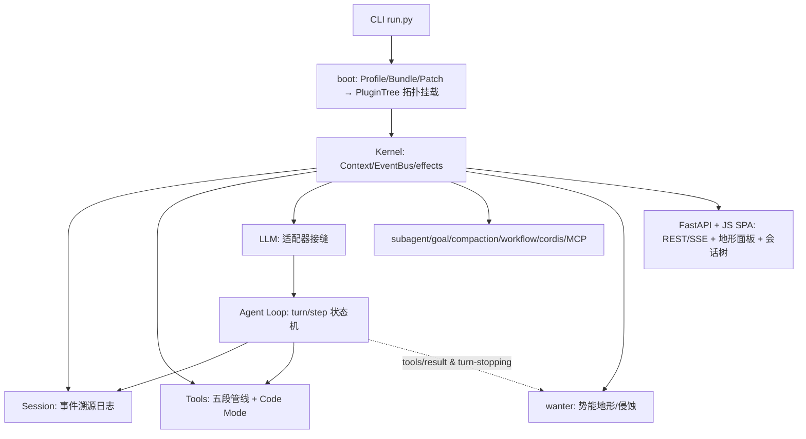

# dsh-python

**DeepSeek Harness 的 Python 重实现** —— 一切皆插件的智能体框架。

[]()
[]()
[]()
[]()
[]()

用纯 Python 完整复刻 dsh 的架构线：**Cordis 式插件内核**（Context 服务仓库、四种事件派发、
可逆效应、YAML 配置树 + 热重载）、**事件溯源会话日志**、**五段工具管线**、**LLM 接缝**、
**Agent 驱动循环**、持久化、Profile/Bundle/Patch、子代理/目标/压缩/命令/后台任务/工作流/
MCP/Code Mode/自指 cordis/会话投影/工作区，以及 FastAPI + 原生 JS 的流式 Web UI。

> 🌟 **明星特性 wanter**（water+ant）：把 agent 会话变成在「经验势能地形」上流动的水滴——
> 纯梯度 0% 逃逸、加噪声 0% 逃逸，**wanter 100% 逃逸**；路径复用 ≈30 倍加速。
> 详见 **[WANTER.md](WANTER.md)** 与实时 Web 地形面板。

> 每个模块 docstring 都标注对应 TypeScript 版概念；完整架构说明见 `manuals/`（21 章函数级手册）。

## ✨ 为什么值得看

| 能力 | 说明 |
|---|---|
| 插件内核 | Cordis 式：服务仓库 + emit/waterfall/parallel/serial + 可逆效应（`ctx.effect`） |
| 配置热重载 | 改 `cordis.patch.yml` 不重启生效（HMR：替换/插入/禁用 + reconfigure） |
| 事件溯源会话 | 只追加日志 = 单一事实来源；崩溃修复、fork/resume、JSONL/SQLite 双后端 |
| 工具管线 | pre-execute(allow/deny/ask) → 单调 guard → execute → post-execute → result；JSON Schema 子集强制 |
| Agent 循环 | turn/step 状态机、重试上限、审批（事件化）、runMaintenance、request-done 观测 |
| Code Mode | `run_code` 保留传输 + Python SDK 生成 + 子调用派发桥（原生并发契约） |
| 自指 cordis | `cordis_define/run/stop/undefine`：模型定义并运行动态插件（不可变包 + 审批门控） |
| MCP | stdio + Streamable HTTP 双传输（JSON/SSE、会话头） |
| 真沙箱 | Windows Job Object（kill-on-close + 内存上限）+ Linux Landlock（只读 FS + 工作区可写），不可用如实降级 |
| hooks 兼容桥 | 直接读 Claude Code `settings.json` / Codex `config.toml`（matcher/stdin JSON/$VAR 替换） |
| wanter | 势能地形 + 水迹蒸发 + 定向侵蚀：物理启发的经验层，量化指标见 WANTER.md |
| 会话投影/工作区/引用 | sessionProjections（框架驱动）+ workspaceRegistry + 跨会话有界快照 |

## 架构



## 快速开始（PyCharm）

1. **环境**：Python ≥ 3.10（已在 3.11 验证）。
2. **依赖**：
   ```sh
   pip install -r requirements.txt
   ```
3. **运行**：直接运行 `run.py`（或终端）：

```sh
python run.py web                              # Web UI → http://127.0.0.1:3080
python run.py headless "总结这个目录" --mock     # 一次性运行（无密钥用 --mock）
python run.py --dump-config                    # 查看组合后的配置树
python run.py plugin init myprofile            # 初始化自定义 profile
```

**模型密钥**：设置 `DEEPSEEK_API_KEY`（可选 `DEEPSEEK_BASE_URL`）后自动用 DeepSeek 官方 API；
未设置时回退内置 **mock 适配器**（离线、确定性），开箱即可运行。

**验证**：

```sh
python -m pytest tests -q      # 期望 224 passed, 1 skipped（Linux-only）
```

## wanter 一分钟

```python
from dsh.boot import boot
ctx, tree = await boot(profile="headless", mock_llm=True)
# agent 每次成功工具调用 → 沉积；停滞 → 侵蚀 + steer（零循环侵入）
# 实时可视化：GET /api/wanter/terrain（SVG）· /static/wanter.html
```


| 指标 | 纯梯度 | +噪声 | **wanter** |
|---|---|---|---|
| 双势阱逃逸率 | 0% | 0% | **100%**（386.5 步 / 9.8 次侵蚀） |
| 路径复用斜率 | — | −0.67 | **−21.76（≈30×）** |
| 语义匹配（oracle vs hash） | — | 0% | **100%（1 步）** |

完整四法则数学、运行机制与全部图表 → **[WANTER.md](WANTER.md)**。

## 目录结构

```
dsh_python/
├── run.py                # PyCharm 快速启动入口
├── WANTER.md             # wanter 专题（四法则/机制/量化指标/图表）
├── dsh/
│   ├── kernel/           # 插件内核：Context/EventBus/Service/Loader/PluginTree
│   ├── session/          # 事件溯源会话（SessionEventMap/surface/derive/store/query）
│   ├── tools/            # 工具系统（define_tool/schema/五段管线/展示词汇/Code Mode）
│   ├── llm/              # LLM 接缝（消息词汇/流协议/适配器/DeepSeek/mock/token-meter）
│   ├── prompt/           # System Prompt 组装（分节/变量/工具 provider）
│   ├── agent/            # Agent 句柄/Inbox/注册表/审批/驱动循环
│   ├── persistence/      # 会话持久化（JSONL/SQLite 后端 + 崩溃修复）
│   ├── fs/ subprocess/   # 文件系统/子进程缝（fs_*、bash/pwsh 工具）
│   ├── jobs/ todo/       # 后台任务 / todo_write
│   ├── subagent/ goal/   # 子代理 / 目标域（续轮驱动）
│   ├── compaction/       # 上下文压缩（压力检测 + replace 摘要）
│   ├── commands/ plan/   # 斜杠命令 / 计划模式
│   ├── skill/ hooks/     # Skills / Hooks 桥 + Claude Code·Codex 兼容
│   ├── preset/           # Agent Presets（作用域挂载 + recompose）
│   ├── schedule/         # 定时任务（interval + cron 表达式）
│   ├── sandbox/          # Windows Job Object + Linux Landlock 真沙箱
│   ├── web/ interaction/ # web_fetch·web_search / ask_user
│   ├── context/          # 上下文注入（time-context / AGENTS.md / 会话引用）
│   ├── settings/ storage/ telemetry/ credentials/ feedback/
│   ├── memory/           # 原生记忆（Jaccard 检索 + storage 持久化）
│   ├── code/             # Code Mode（run_code 传输 + Python 代码执行 + SDK）
│   ├── cordis/           # 自指 cordis（动态 Cordis Plugin 运行器）
│   ├── projection/ workspace/  # 会话投影 / 工作区实体注册表
│   ├── workflow/         # 工作流引擎（结构化输出强制）
│   ├── mcp/              # MCP 客户端（stdio + Streamable HTTP）
│   ├── wanter/           # wanter 动力学（引擎/插件/校准/可视化）
│   ├── config/ boot.py cli/   # 组合与启动
│   └── server/           # FastAPI Web 服务（REST/SSE/地形面板/会话树）
├── tests/                # pytest 套件（225 用例 + fixtures；Windows 上 224 passed + 1 skipped）
├── examples/             # 示例插件 + wanter 实验/图表（SVG 产出）
└── manuals/              # 21 章中文开发手册（函数级技术细节）
```

## 核心概念速览

| 概念 | 说明 |
|---|---|
| **Context** | 服务仓库：`ctx.tools` / `ctx.llm` / `ctx.sessions`…按 key 解析，provider 可换 |
| **事件** | `emit`（广播）/ `waterfall`（洋葱中间件）/ `parallel` / `serial` |
| **可逆效应** | 一切注册经 `ctx.effect(disposer)`，卸载逆序回滚（HMR 基础） |
| **Session** | 只追加事件日志（单一事实来源），模型历史由 `derive_messages()` 派生 |
| **工具管线** | pre-execute → 单调 guard → execute → post-execute → result |
| **Profile/Bundle/Patch** | `~/.dsh/profiles/<name>/cordis.patch.yml` 按 id 覆盖任意插件行 |
| **turn/step** | step = 一次模型请求 + 其工具调用；turn = 零或多个 step |

## 自定义（扩展四层次）

1. **改配置**：编辑 profile 的 `cordis.patch.yml` 按 id 覆盖/禁用/插入行（热重载生效）；
2. **装插件**：把你的插件模块放进 profile 的 `bundles/` 或 insert 行指向它；
3. **写插件**（推荐）：继承 `dsh.kernel.Service`，声明 `provides/inject`，在 `apply(ctx)` 里
   注册工具/事件/分节（示例见 `examples/my_plugin.py`）；
4. **改内核**：`dsh/` 下任何服务都是可替换的 provider（能力缝）。

## 文档

- 架构总览与模块手册：[`manuals/README.md`](manuals/README.md)（21 章，函数级）；
- 与 TS 版差异对照与补齐记录：[`manuals/13`](manuals/13-%E4%B8%8ETS%E7%89%88%E5%B7%AE%E5%BC%82%E5%AF%B9%E7%85%A7%E4%B8%8E%E8%A1%A5%E9%BD%90%E8%AE%B0%E5%BD%95.md)；
- wanter 专题：[`WANTER.md`](WANTER.md)。

## 🔍 最新审计与架构问题修复（2026-08 全面审计批次）

双路审计（代码 bug 猎杀 11 个高危模块 + 手册逐模块对照 135 文件 / 744 公开符号），
**10 项真实 bug 全部修复**并配回归测试，详见
[`manuals/13` §15](manuals/13-%E4%B8%8ETS%E7%89%88%E5%B7%AE%E5%BC%82%E5%AF%B9%E7%85%A7%E4%B8%8E%E8%A1%A5%E9%BD%90%E8%AE%B0%E5%BD%95.md#15-第十二批全面审计代码-bug-猎杀--手册对照实施记录)：

| 级别 | 问题 | 修复 |
|---|---|---|
| 🔴 严重 | **surface replace 顺序**：压缩摘要被追加到末尾，派生历史顺序错乱 | 新节点插入被替换区间原位置 |
| 🔴 严重 | **Linux Landlock 后端整体失效**：读/执行进了 handled 却无放行规则 | 补根路径只读放行规则 |
| 🟡 中等 | **schema 假校验**：properties 缺 `type:"object"` 时任何值静默通过 | fail loud 强制声明 |
| 🟡 中等 | **`temperature=0` 被默认值覆盖**（确定性采样失效） | `is not None` 判断 |
| 🟡 中等 | **fork 边界漏检**「前缀结束于 turn 中段」 | turn 深度平衡扫描 |
| 🟢 轻微 | flush 契约恒 True · ApprovalService 空配置崩溃 · `_cancel_cause` 跨 turn 泄漏 · MCP 写失败 pending 泄漏 · **wanter 子任务完成用错坐标**（移除错误目标） | 全部修复 |

✅ 审计结论：kernel / 工具三段调度 / Code Mode 调度器 / cordis 审批竞态 / wanter
数值稳定性 / 投影·工作区·会话引用 —— **无问题**；40 个能力缝全挂载、131 模块
导入零失败、手册与代码三方对齐。回归：`tests/test_audit_fixes.py`（8 项）。

## 测试

```sh
python -m pytest tests -q   # 224 passed, 1 skipped（Linux-only Landlock 用例）
```

## 许可证

[MIT](LICENSE)
